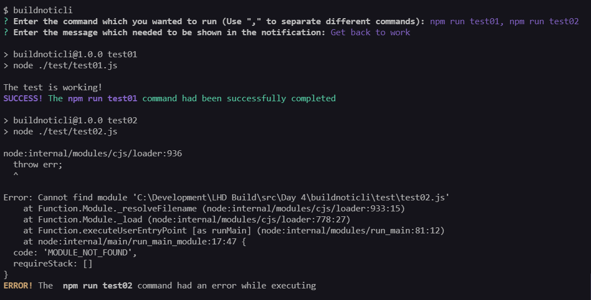
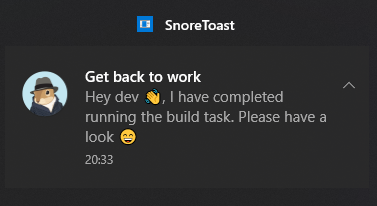

# buildnoticli

A CLI which sends notification after running a command

## Installation

To install the CLI, run the following command

```bash
$ npm i buildnoticli -g
```

You can remove `-g` if you don't want to install it globally

## Usage

To run the CLI run `buildnoticli` command in the terminal and answers the following questions.

## Demo





## Common issues

### Notification not been sent

If using are using windows, follow the following steps

- Go to settings
- Search for `Notifications and actions`
- Make sure to turn on the `Get notification from apps and other senders` option on


## What's next for buildnoticli

- Add arguments based commands
  - Add a most similar command finder
- Add a terminal task list
